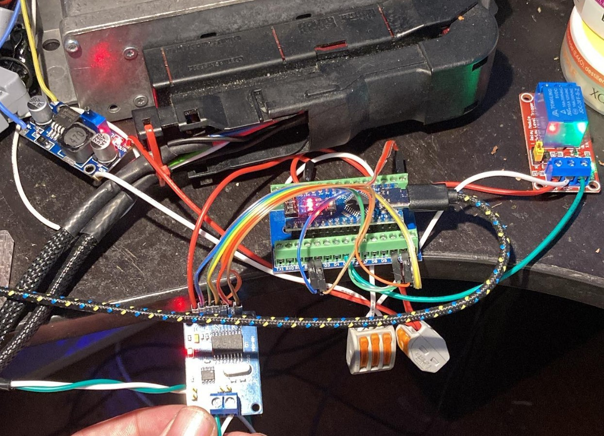
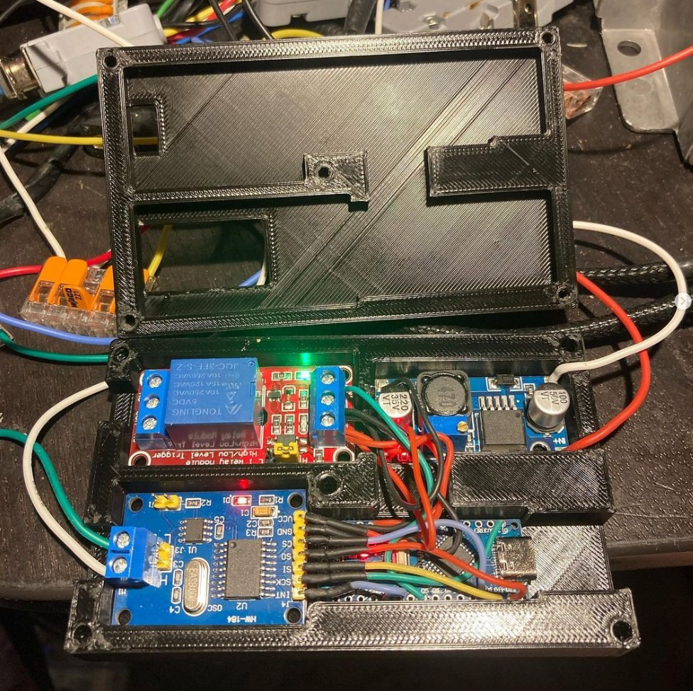
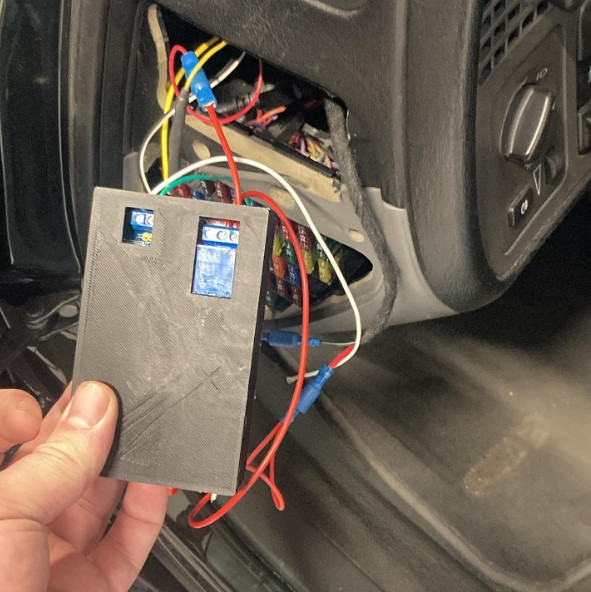

# Arduwbl - Arduino based Trionic7 canbus reader that turns on a relay when the engine is running

By listening in to the periodic canbus messages from the Trionic7 ECU, this Arduino based device can turn on a relay when the engine is running. This can be used to power a wideband lambda or other devices that should only be powered when the engine is running.

## Hardware
* Arduino Nano
* MCP2515 CAN bus module
* 5V Relay board
* DC-DC Step-down converter (12V to 5V)





## MCP2515 wiring


```
INT -> 2
SCK -> 13
SI -> 11
SO -> 12
CS -> 10 
GND -> GND
VCC -> 5V
```

## Relay board
```
IN -> 5
DC+ -> 5V
DC- -> GND
```

## CAN bus

0x280 - Engine is running status
0x5C0 - Engine temperature